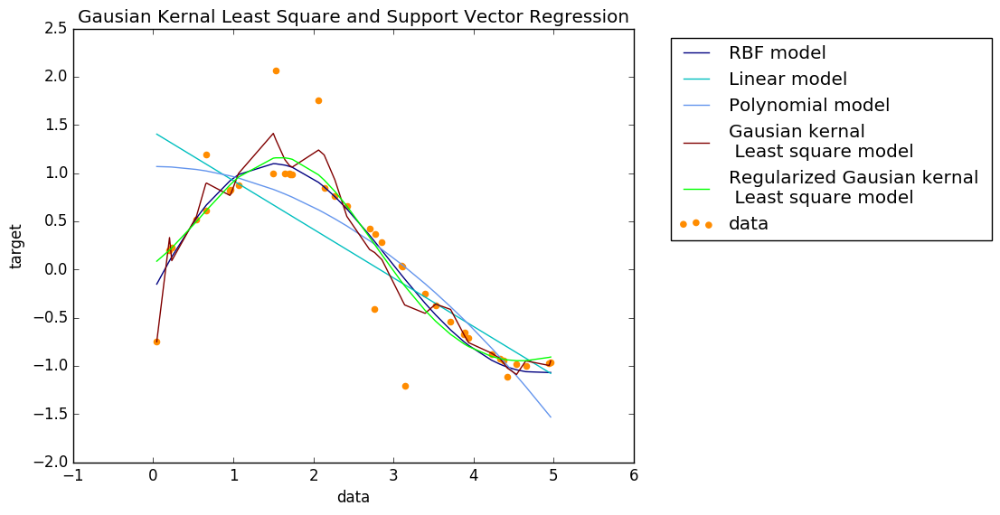

# Gaussion-Kernal-Least-Squares-Regression
Regularized linear basic function model with Guassion kernal; A 1D least square regression comparing to SVM using linear, polynomial and RBF kernal.

M is the number of Gaussion kernal functions and lamda is the regularization coefficent,Mu is the array of kernal functions' means( Locations of the basis functions in input space).

The the kernal means are chosen equaly distributed in the data space, and spacial scale of kernal funtion is set to one. 

### Below is generated plot from the python code with M=20 and lamda=1:

